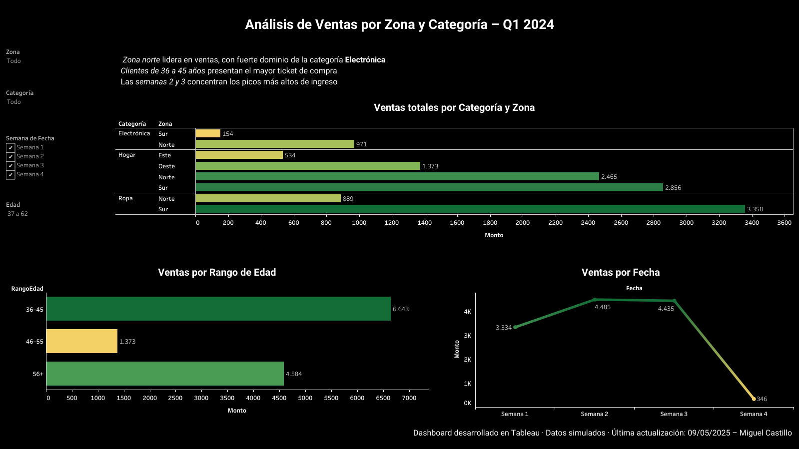

# 🧠 Dashboard de Análisis de Ventas – Q1 2024

Este proyecto presenta un análisis visual de ventas simuladas correspondientes al primer trimestre de 2024. Fue desarrollado en Tableau con el objetivo de identificar patrones de compra, zonas con mayor actividad comercial y segmentos de clientes con mayor impacto.

## 📸 Vista general del Dashboard

## 📁 Estructura del proyecto

- `Proyecto_Ventas_Q1_MiguelCastillo.twbx` → Archivo empaquetado de Tableau
- `Dashboard_Ventas_Q1_MiguelCastillo.png` → Imagen exportada del dashboard
- `Resumen_Proyecto_Ventas_Q1.pdf` → Documento ejecutivo con insights y descripción técnica
- `/data/` → Carpeta opcional con los CSV simulados (ventas, clientes, productos)

## 📊 Objetivo

Identificar tendencias de ventas por zona geográfica, categoría de producto y rango de edad del cliente, con el fin de brindar información accionable para decisiones comerciales.

## 🧱 Fuentes de datos

Tres archivos CSV simulados:
- `ventas.csv`
- `clientes.csv`
- `productos.csv`

Relacionados mediante:
- `ID_cliente` (ventas → clientes)
- `ID_producto` (ventas → productos)

## 🔍 Procesos aplicados

- Integración de datos con joins múltiples
- Agrupación de edades por rangos personalizados
- Visualización por semana, zona y categoría
- Filtros interactivos y tooltips dinámicos
- Exportación en formato imagen y PDF para portafolio

## 💡 Insights clave

- La **zona sur** registró el mayor volumen de ventas  
- Las categorías más destacadas en esa zona fueron **Ropa** y **Hogar**  
- El grupo de edad **36–45 años** generó el mayor gasto  
- Las **semanas 2 y 3** concentraron los picos de ingreso

## 📌 Herramientas utilizadas

- Tableau Public
- FPDF (para resumen PDF)
- GitHub (para documentación)
- Excel/CSV como fuente de datos estructurada

## 🧑‍💻 Autor

**Miguel Ángel Castillo Sánchez**  
📫 [LinkedIn](https://www.linkedin.com/in/miguel-%C3%A1ngel-castillo-s%C3%A1nchez-0b99a0194/)  
🔗 [Dashboard en Tableau Public](https://public.tableau.com/app/profile/miguel.angel.castillo.sanchez/viz/DashboarddeAnlisisdeVentasQ12024/Dashboard1)